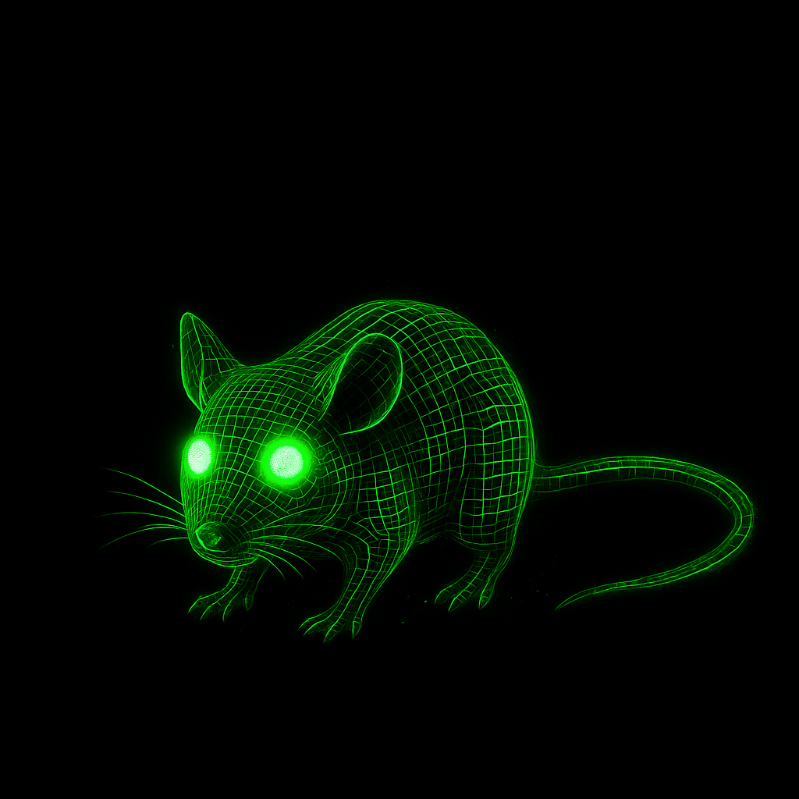

### **`cybermutator.py`** helps you create your own cybermutator to simulate a hypermutator. 

It uses `msprime` to simulate a lineage tree of single cells in the developing animal, then uses a custom finite sites mutation simulator to add somatic mutations based on COSMIC SBS signatures.

    options:
    -h, --help            show this help message and exit
    --cells CELLS         Integer. The number of cells in your simulated sample
    --reps REPS           Integer. Number of simulation replicates
    --sequence SEQUENCE   Optional: the sequence you would like to simulate mutations on. Leave empty to randomly generate a sequence, or
                            query a ref genome for a sequence.
    --seq_len SEQ_LEN     Integer. Length of randomly generated sequence to simulate mutations on.
    --new_seq_per_rep     Include flag if you want to generate a new random sequence each replicate. Overrides other seq arguments.
    --genome GENOME       Specify genome to generate random sequence with appropriate GC content. Currently only mm10 is supported
    --genome_fasta GENOME_FASTA
                            Path to indexed fasta to query
    --regions REGIONS [REGIONS ...]
                            region or list of regions (separated by spaces) of provided reference genome to simulate mutations within, in the
                            following format: chr1:200-300
    --growth_model GROWTH_MODEL
                            currently only exponential is supported
    --coalescent_model COALESCENT_MODEL
                            Model provided to msprime.sim_ancestry
    --Ne NE               Integery. Population size at time of simulated sampling.
    --Mu MU               Float. Overall mutation rate. default=2e-6
    --sbs_signatures SBS_SIGNATURES [SBS_SIGNATURES ...]
                            Path or list of paths (separated by spaces) to COSMIC SBS signatures in default tsv format. The two PolE-P286R
                            signatures (SBS10a and SBS10b) and SBS5 are provided and used by default.
    --sbs_weights SBS_WEIGHTS [SBS_WEIGHTS ...]
                            floats separated by spaces. SBS signature weights, used if multiple signatures provided.
    --outdir OUTDIR       Directory for outputs. Will be created if it does not exist
    --name NAME           name for your simulation, will be the prefix of output files.
    --save SAVE           True or False. Whether to save outputs. Default = True
